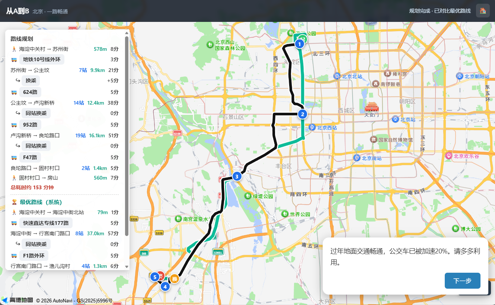

# 城市公共交通制霸（从A到B）

一个「规划最快公交/地铁路线」的单机游戏。看看你有多接近最快时间。

<p align="center">
  
</p>

灵感来源于作者不喜欢用导航的时光。

当前支持模式：**故事模式· 自由模式 · 无尽爬塔模式**

当前支持城市：**北京**

---

## 特性

- **本地寻路**：不依赖任何网络，`js/router.js` 在「逻辑站 × 线路」状态空间上做 Dijkstra，支持一些有意思的畸变待你探索。
- **故事模式**：6 个带剧情（Galgame 对话框 + 教学泡泡）的关卡，逐关解锁。
- **自由模式**：随机起终点，可勾选情景。
- **无尽模式（爬塔）**：随机起终点，每层要求「比最优慢 ≤ 固定百分比」，从 100% 逐层收紧到 1%；4 个畸变按钮分别记录成绩，支持中途退出续玩。
- **本地步行估算**：步行一律用直线距离 / 75 m/min。
- **成本模型**：地铁 35 km/h；公交按线路平均站间距动态给巡航速度（城区密站慢、郊区大站快）。
- **零依赖**：shapefile 解析器（`lib/shp.js`）已经写好。

---

## 快速开始

### 方式一：直接下载 Release（推荐，免安装）

只想玩、不想装任何东西？直接去本仓库的 **[Releases](https://github.com/ChenpengZhang/MapGame/releases)** 页面：

1. 按你的系统下载对应的压缩包：
   - **Windows** → `MapGame-win-x64.zip`
   - **macOS（M 系列芯片）** → `MapGame-darwin-arm64.tar.gz`
   - **macOS（Intel 芯片）** → `MapGame-darwin-x64.tar.gz`
   - **Linux** → `MapGame-linux-x64.tar.gz`
2. 解压后双击 **`Start-Game.bat`**（Windows）/ **`Start-Game.command`**（macOS）/ **`Start-Game.sh`**（Linux）
3. 程序会自动打开默认浏览器进入游戏，无需安装 Node.js。

> **Windows 提示**：exe 未做代码签名，首次运行若出现「Windows 已保护你的电脑」，点「更多信息 → 仍要运行」即可。

### 方式二：源码运行（开发者）

#### 1. 前提
- Node.js 18+（已验证 v24，脚本零依赖）。

#### 2. 启动（免 Key，默认即可玩）
```bash
node server.js
```
浏览器打开 **http://localhost:8080**（会自动打开）。

地图默认用 **Leaflet + OpenStreetMap**（免费、免 Key、开箱即用），无需任何配置。

> 若 `data/beijing-transit.json` 不存在，会回退到 `data/sample.json`（6 条演示线路）。

### （可选）配置高德 Key，切换高德底图
想用高德底图的话，在游戏内「设置 → 高德地图 Key」填入即可：

1. [高德开放平台](https://lbs.amap.com/) →「控制台 → 应用管理 → 创建新应用」→「添加 Key」（设置页里有直达教程链接）
2. 服务平台选 **Web端(JS API)**
3. 把 **Key（jsApiKey）** 和 **安全密钥（securityJsCode）** 填进设置页，点「保存 Key」
4. 在 Key 的「设置」里把**域名白名单**加上 `http://localhost:8080`（否则地图报 `INVALID_USER_DOMAIN`）。Release 版同样用这个端口。

> Key 只保存在**浏览器本地缓存（localStorage）**里，不会以任何形式上传。
> 填 Key 保存后刷新 → 用高德底图；把 Key 清空再保存 → 回到免 Key 的 OSM 地图。

---

## 数据生成（CPTOND-2025）

全量数据来自开源数据集 **CPTOND-2025**（[figshare](https://figshare.com/articles/dataset/CPTOND-2025/29377427)，WGS-84）。

```bash
node cptond-convert.js
```
生成 `data/beijing-transit.json`（约 2213 条线路、5.7 万站记录、18.9MB，含 WGS-84→GCJ-02 转换、双向合并、逐站距离、路径抽稀、幽灵站剔除等）。

全项目只维护这一份 **GCJ-02** 数据：高德底图和OSM只涉及一个简单坐标变换。内存也只需一份（约 87MB）。

> 数据处理的完整细节、踩过的坑、迁移到新城市的清单见 **`docs/数据管线与城市迁移指南.md`**。

---

## 数据格式（beijing-transit.json）

```jsonc
{
  "city": "北京",
  "count": 2213,
  "lines": [
    {
      "id": "L_xxx", "name": "地铁2号线外环", "mode": "metro",
      "front": "西直门", "terminal": "积水潭",
      "stops": [ { "id": "BV…@lng,lat", "name": "西直门", "lng": 116.35, "lat": 39.94, "seq": 1, "d": 1.2 } ],
      "path": [ [116.35, 39.94], … ]   // GCJ-02 轨迹（高德直接用；OSM 在渲染边界换算回 WGS-84）
    }
  ]
}
```
- `d`：该站到下一站的公里数（末站为 `null`）。
- 站点 `id` 是 `原始id@lng,lat` 复合键，避免 CPTOND 里「临时站」复用同一 id 的问题。

---

## 目录结构

```
MapGame/
├── server.js              # 本地静态服务器（node server.js）
├── build-release.js       # 发布打包脚本（node build-release.js）
├── .github/workflows/     # GitHub Actions 自动发版（push v* 标签触发）
├── index.html             # 主界面 + 各菜单/弹窗
├── js/                    # 前端源码（分层，详见 docs/前端架构.md）
│   ├── app.js             #   入口：引导 + 组装 + 事件绑定（组合根，~130 行）
│   ├── router.js          #   本地寻路器（Dijkstra，Node/浏览器通用，不参与分层）
│   ├── amap-polyfill.js   #   Leaflet+OSM 免 Key 地图后端（模拟高德 API，不参与分层）
│   ├── core/              #   基础层：常量 / 状态 / DOM工具 / 事件总线 / 存储 / 寻路器适配
│   ├── data/              #   数据层：关卡剧本 / 数据加载 / 站点索引
│   ├── map/               #   地图渲染层：动画 / 站点图层 / 路线图层 / 步行
│   ├── game/              #   玩法层：路线规划 / 时间模型 / 会话 / 爬塔 / 结算
│   └── ui/                #   表现层：路线面板 / 结果弹窗 / 菜单 / 剧情对话框
├── cptond-convert.js      # CPTOND → beijing-transit.json（主数据管线）
├── test-router.js         # 寻路器 Node 回归测试（node test-router.js）
├── test-integrity.js      # 数据完整性检查（逻辑站 id 唯一性等）
├── test-optimal-invariant.js # 「最优 ≤ 玩家」不变式验证
├── calibrate-collect.js   # 采高德真实路径规划样本（校准用，需 Web 服务 key）
├── calibrate.js           # 成本模型锚点法校准
├── benchmark.js           # 本地模型 vs 高德真实耗时（端到端误差）
├── lib/shp.js             # 最小 shapefile 读取器（零依赖）
├── fonts/                 # ChillRoundF（寒蝉全圆体，SIL OFL 1.1，本地打包）
├── data/
│   ├── sample.json         # 演示数据（开箱即用）
│   ├── beijing-transit.json        # 全量数据（GCJ-02，唯一数据源）
│   └── cptond/             # CPTOND 原始 shapefile（含北京/其它城市地铁，gitignore）
└── docs/
    ├── 技术方案.md        # 早期竞品调研 + 可行性 + 架构
    └── 数据管线与城市迁移指南.md  # 数据管线 + 踩坑记录 + 新城市迁移清单
```

---

## 测试

```bash
node test-router.js            # 寻路回归测试（故宫→国贸 正常/禁用地铁）
node test-integrity.js         # 数据完整性：逻辑站 id 唯一、物理站线路映射无缺失
node test-optimal-invariant.js # 不变式：系统最优 ≤ 玩家可达方案（防「最优比玩家慢」）
node test-app-smoke.mjs        # 前端冒烟测试（模块图 + 主流程，Node 桩环境，无需浏览器）
node --check js/router.js
```

### 成本模型校准（可选，需高德「Web服务」key）

用高德真实路径规划反推本地成本模型参数，并做端到端误差评估：

```bash
$env:AMAP_WEB_KEY="你的Web服务key"    # 仅存环境变量，不进代码/仓库
node calibrate-collect.js 100         # 采 100 对随机起终点 → data/calibrate-samples.json
node calibrate.js                     # 锚点法校准（含 train/test 稳定性检查）
node benchmark.js                     # 端到端：本地模型 vs 高德真实耗时
```

> 校准结论：地铁巡航速度 35 km/h 基本准确；公交长段实测约 21 km/h、步行约 65 m/min 偏低。
> 等车/换乘/停站无法从高德 transit 数据辨识（其 duration 不含独立等车信号），保持原值。

---

## 无 Key 上手（开箱即玩）

**默认就是免 Key 的**：地图用 Leaflet + OpenStreetMap 瓦片（免费、无需注册），寻路、步行、剧情、爬塔全部是本地逻辑，没有任何外部依赖。

两个地图后端共用同一份 **GCJ-02 数据**，全程无偏移、路由一致：

- **未配置 Key** → `js/amap-polyfill.js` 用 Leaflet 模拟高德 API，底图为 OSM；坐标换算（GCJ-02→WGS-84）全部在该兼容层的渲染边界完成，app.js 无感知；
- **设置里填了高德 Key** → 加载真实高德 JS API，底图为高德，直接用 GCJ-02，零换算、零改动。

但：推荐使用高德地图底图游玩。响应更自然，国内细节更完整，没有地图合规问题。

## 免责叠甲
此游戏纯属虚构，限于数据质量和代码复杂度，规划的路线可能存在很多严重不符合现实的情况，请勿将其作为现实世界参考。

一切实际交通规划请以权威国内在线地图为准。

然而，若有任何建议欢迎友好交流！