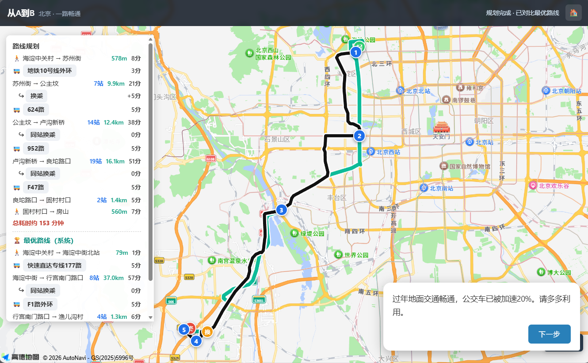

# TransitGuesser — 公交导航模拟器

一个「规划最快公交/地铁路线」的单机游戏。看看你有多接近最快时间。

<p align="center">
  
</p>

灵感来源于作者不喜欢用导航的时光。

当前支持模式：**故事模式 · 随机模式 · 无尽爬塔模式 · 每日挑战 · 自定义模式**

当前支持城市：**北京 上海 广州 深圳 成都 重庆 杭州 武汉 南京 天津 青岛 昆明 厦门 济南 郑州 长春 大同**

---

## 玩法

- **故事模式**：四关新手教学，学会单线乘车、换乘、限时与步行范围、快车与慢车。
- **随机模式**：随机起终点，随机抽一种情景，开局即玩。
- **无尽模式**：每层要求不比最快路线慢太多，从 100% 逐层收紧到 1%；6 种情景各自记录成绩：普通、地铁瘫痪、一路畅通、大雨滂沱、**盲棋**（没有底图）、**真实乘坐**（不能撤回、出发前只看得到附近的站）。
- **每日挑战**（需登录）：每天一道全站同题，排行按公共交通用时；第二天可以看昨天的答案。
- **自定义模式**：自己出题、组关卡组分享给别人玩，有单独的排行。

寻路完全在本地完成（`shared/router.js`，在「站 × 线路」上做 Dijkstra），不依赖任何在线地图服务。

---

## 快速开始

### 方式一：直接下载 Release（推荐，免安装）

只想玩、不想装任何东西？直接去本仓库的 **[Releases](https://github.com/ChenpengZhang/MapGame/releases)** 页面：

1. 按你的系统下载对应的压缩包：
   - **Windows** → `MapGame-win-x64.zip`
   - **macOS（M 系列芯片）** → `MapGame-darwin-arm64.tar.gz`
   - **Linux** → `MapGame-linux-x64.tar.gz`
2. 解压后双击 **`Start-Game.bat`**（Windows）/ **`Start-Game.command`**（macOS）/ **`Start-Game.sh`**（Linux）
3. 程序会自动打开默认浏览器进入游戏，无需安装 Node.js。

> **Windows 提示**：exe 未做代码签名，首次运行若出现「Windows 已保护你的电脑」，点「更多信息 → 仍要运行」即可。

### 方式二：源码运行

需要 Node.js 18+：

```bash
node server.js
```

浏览器会自动打开 **http://localhost:8080/**。地图默认用免 Key 的 **Leaflet + OpenStreetMap**，无需任何配置。

想用高德底图（推荐，国内细节更完整）：在游戏内「设置 → 高德地图 Key」填入 **Web端(JS API)** 的 Key 和安全密钥（设置页里有申请教程），并在 Key 的域名白名单里加上 `http://localhost:8080`。Key 只保存在浏览器本地，不会上传。

---

## 开发

登录、每日挑战、排行榜等需要后端（Node.js 22.13+ 与 PostgreSQL），配置方法见 [`backend/README.md`](backend/README.md)：

```bash
cd backend && npm ci && cp .env.example .env   # 首次：填入本机数据库连接与认证密钥
cd .. && npm run dev                           # 同时启动前端与后端，访问 http://localhost:8080/mapgame/
npm test                                       # 前端与数据回归测试
```

更多文档：
- [前端架构](docs/前端架构.md)：代码分层、仓库目录、测试命令
- [数据管线与城市迁移指南](docs/数据管线与城市迁移指南.md)：交通数据从哪来、怎么转换、文件格式、新增城市的步骤
- [技术方案](docs/技术方案.md)：整体设计、成本模型与校准

交通数据来自开源数据集 **CPTOND-2025**（[figshare](https://figshare.com/articles/dataset/CPTOND-2025/29377427)）。

---

## 免责叠甲
此游戏纯属虚构，限于数据质量和代码复杂度，规划的路线可能存在很多严重不符合现实的情况，请勿将其作为现实世界参考。

一切实际交通规划请以权威国内在线地图为准。

然而，若有任何建议欢迎友好交流！

---

## 后续计划

- 北京加入公交间隔信息
- 加入更多城市
- 更多游戏模式与排位
- 部分线路名称仍带有冗余的“北段 / 中段”等信息
